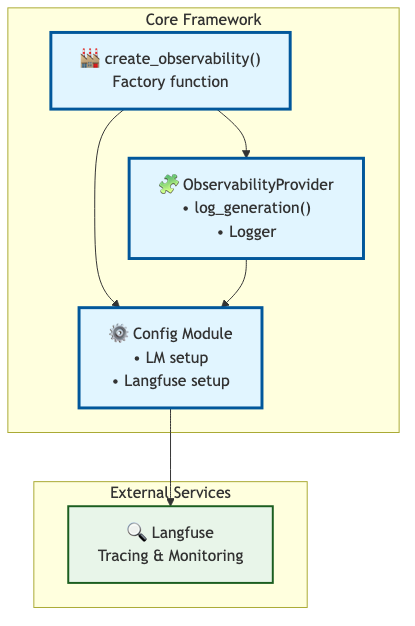

# Observable Agent Starter


**Production-ready DSPy agent framework with Langfuse observability and automated testing.**

## What This Starter Gives You

| Component | What | Where |
|-----------|------|-------|
| **Base Framework** | `ObservabilityProvider` with config + tracing | `src/observable_agent_starter/` |
| **Observability** | Langfuse integration | Auto-configured via env vars |
| **Testing** | pytest + CI/CD | `tests/` + GitHub Actions |
| **Examples** | Coding agent + Influencer assistant | `examples/` |
| **Evaluations** | DeepEval (example-scoped) | `examples/influencer_assistant/evals/` |

## Pre-wired Stack

- **DSPy** - Structured LLM programming
- **Langfuse** - Observability and tracing
- **pytest** - Testing framework
- **DeepEval** - LLM quality metrics (influencer example)
- **GitHub Actions** - CI/CD pipeline

## Get Started in 3 Minutes

**This is a GitHub template.** Create your own project with automated setup:

1. Click **"Use this template"** → "Create a new repository"
2. Clone your repo and customize:
   ```bash
   python scripts/customize_template.py \
     --name your_project \
     --author "Your Name" \
     --email you@example.com
   ```
3. Install and verify: `make dev && make test`

The script automatically renames the package, updates all imports, and configures your project. [Full setup guide →](#using-as-github-template)

---

## Architecture

The framework uses a minimal composition pattern for clean dependency injection:



The core provides:
- `create_observability()` - Factory function for setup
- `ObservabilityProvider` - Injected into agents for tracing
- `Config Module` - LM and Langfuse configuration

[Full architecture documentation →](docs/architecture.md)

---

## Quick Start

```bash
# 1. Install
make dev

# 2. Configure
export OPENAI_API_KEY=...
export LANGFUSE_PUBLIC_KEY=...      # Optional
export LANGFUSE_SECRET_KEY=...      # Optional

# 3. Run tests
make test
```

---

## Structure

```
src/observable_agent_starter/   # Core framework
  ├── observability.py           # ObservabilityProvider with composition pattern
  ├── config.py                  # LM + Langfuse configuration
  └── __init__.py

examples/                        # Example implementations
  ├── coding_agent/              # Code generation with gates
  └── influencer_assistant/      # Content ideation with DeepEval

tests/                           # Framework tests
  ├── test_observability.py
  └── test_config.py
```

---

## Examples

### 1. Influencer Assistant - Interactive Demo with DeepEval

Demonstrates:
- Composition pattern with `ObservabilityProvider`
- DSPy prompt optimization (teleprompting)
- **DeepEval quality metrics** (relevancy, faithfulness, pillar adherence)
- **Interactive Streamlit dashboard** (best for screenshots!)

**Try the interactive demo:**
```bash
cd examples/influencer_assistant
pip install -e '.[dev]'

# Launch dashboard
streamlit run dashboard/app.py

# The dashboard shows:
# - Creator profile visualization
# - AI-powered video idea generation
# - Langfuse tracing in action
```

**Run quality metrics:**
```bash
pytest tests/ -v   # Unit tests
pytest evals/ -v   # DeepEval quality metrics
```

[Full documentation →](examples/influencer_assistant/README.md)

### 2. Coding Agent - Agent-in-the-Loop

Demonstrates:
- Composition pattern with `ObservabilityProvider`
- DSPy Chain-of-Thought with guardrails
- Git integration + PR workflow
- Operational quality gates (lint, tests, type-check)

**Example: AI-powered file creation with quality gates**


The agent generates new files, automatically strips markdown formatting, runs linting and tests, and creates git commits.

[Full documentation →](examples/coding_agent/README.md)

---

## Building Agents with Composition

```python
from observable_agent_starter import ObservabilityProvider, create_observability
import dspy

class MyAgent(dspy.Module):
    """Your custom agent."""

    def __init__(self, observability: ObservabilityProvider):
        super().__init__()
        self.observability = observability

        # Your DSPy signatures, modules, etc.
        self.predict = dspy.ChainOfThought(MySignature)

    def forward(self, **kwargs):
        # Your agent logic
        result = self.predict(**kwargs)

        # Log to Langfuse
        self.observability.log_generation(
            input_data=kwargs,
            output_data={"result": result.output}
        )

        return result

# Usage
observability = create_observability("my-agent")
agent = MyAgent(observability=observability)
```

**ObservabilityProvider provides:**
- Langfuse tracing via `log_generation()`
- Logging infrastructure
- Optional LM configuration via `create_observability()`

**You provide:**
- DSPy signatures and modules
- Agent logic and fallback handling
- Domain-specific evaluation strategy

---

## Why This Helps

**For Production:**
- Observable by default (Langfuse traces)
- Testable (pytest + CI)
- Extensible (ready for your deployment layer)

---

## Documentation

### Quick Links

- [Architecture Overview](docs/architecture.md) - System design and components
- [How to Build Agents](docs/how-to/extend-observability-provider.md) - Step-by-step agent creation guide
- [Contributing Guidelines](CONTRIBUTING.md) - Development workflow and standards
- [Code of Conduct](CODE_OF_CONDUCT.md) - Community guidelines

### Learn More

- **[Architecture](docs/architecture.md)** explains the composition pattern with ObservabilityProvider, observability layer, and quality assurance strategy
- **[Building Agents Guide](docs/how-to/extend-observability-provider.md)** walks through creating custom agents with examples and best practices
- **[Examples](examples/)** demonstrate production-ready patterns:
  - [Coding Agent](examples/coding_agent/README.md) - File generation with quality gates
  - [Influencer Assistant](examples/influencer_assistant/README.md) - Content ideation with DeepEval

---

## Using as GitHub Template

This repo is configured as a GitHub template for easy project creation.

### Quick Start (Recommended)

1. **Create from template:**
   - Click "Use this template" → "Create a new repository"
   - Name your repo (e.g., `my-agent-project`)
   - Clone your new repo locally

2. **Customize for your project:**
   ```bash
   cd my-agent-project
   python scripts/customize_template.py \
     --name my_agent_project \
     --author "Your Name" \
     --email you@example.com \
     --description "My awesome LLM agent"
   ```

3. **Verify customization:**
   ```bash
   make dev              # Install dependencies
   make test             # Run tests (should pass)
   my-agent-project --version   # Test CLI works
   ```

4. **Configure secrets:**
   - Copy `.env.example` to `.env`
   - Add your `OPENAI_API_KEY`
   - Add `LANGFUSE_*` keys (optional, for observability)

5. **Start building:**
   - Your package is in `src/my_agent_project/`
   - Add your agent logic using `ObservabilityProvider`
   - Extend `cli.py` with your commands
   - Write tests in `tests/`

### What the Customization Script Does

The `customize_template.py` script automates ~15 manual steps:
- Renames `src/observable_agent_starter` → `src/yourproject`
- Updates all imports throughout the codebase
- Updates `pyproject.toml` metadata
- Updates CI workflow references
- Updates README badges
- Creates `.env.example` with template values

**Time saved:** ~30 minutes of manual renaming and find/replace

### Post-Template Checklist

After running the customization script:

- [ ] Review changes: `git diff`
- [ ] Update README.md with your project description
- [ ] Configure `.env` with your API keys
- [ ] Test: `make test` passes
- [ ] Test: `yourproject --version` works
- [ ] Update GitHub repo settings (description, topics)
- [ ] Configure CI secrets in GitHub (for Langfuse, Codecov)
- [ ] Commit: `git add . && git commit -m "chore: customize from template"`
- [ ] (Optional) Delete `examples/` if you don't need them

### Alternative: Manual Setup

If you prefer not to use the template feature:

1. Clone or download this repo
2. Remove `.git` and start fresh: `rm -rf .git && git init`
3. Run the customization script (as shown above)
4. Create your own GitHub repo and push

---

## Roadmap

### v0.3.0 (Current)
- Composition-based ObservabilityProvider pattern
- Pre-commit hooks and code formatting
- Comprehensive documentation (architecture, contributing, how-to guides)
- Security scanning (Bandit, pip-audit)

### Future Enhancements
- **Demo Assets** - Add animated GIF showing agent execution + Langfuse tracing
- **More Examples** - Additional agent patterns (RAG, tool use, multi-agent)
- **Testing Utilities** - Helper fixtures and mocks for agent testing
- **Deployment Templates** - Docker, AWS Lambda, and Cloud Run examples

See [GitHub Issues](https://github.com/ammons-datalabs/observable-agent-starter/issues) for detailed roadmap and feature requests.

---

## License

MIT

---

> **Ammons Data Labs** builds observable, measurable AI agents and data systems.
