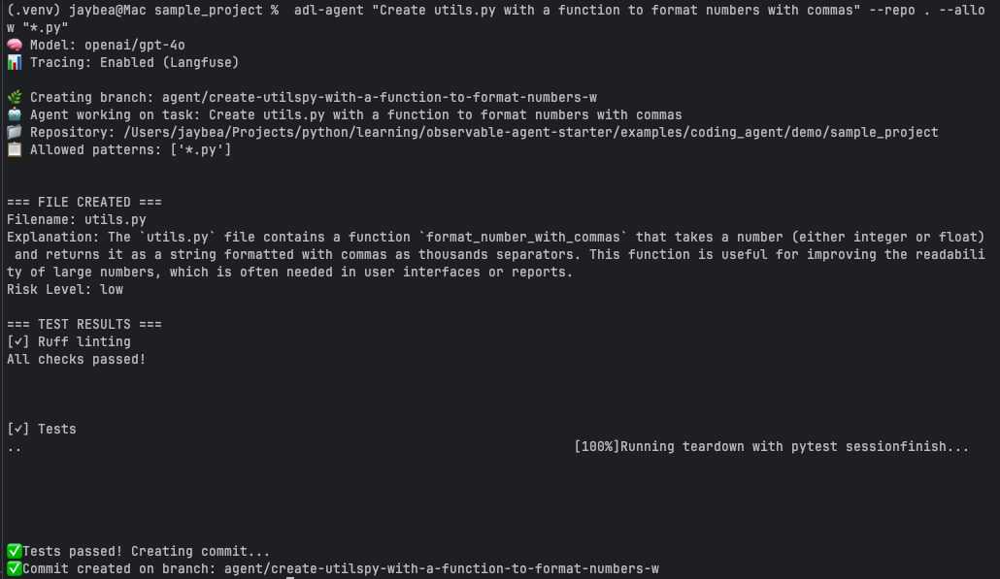

# Observable Agent Starter


**Production-ready DSPy agent framework with Langfuse observability, automated testing, and deployment templates.**

## What This Starter Gives You

| Component | What | Where |
|-----------|------|-------|
| **Base Framework** | `ObservabilityProvider` with config + tracing | `src/observable_agent_starter/` |
| **Observability** | Langfuse integration | Auto-configured via env vars |
| **Testing** | pytest + CI/CD | `tests/` + GitHub Actions |
| **Examples** | Coding agent + Influencer assistant | `examples/` |
| **Evaluations** | DeepEval (example-scoped) | `examples/influencer_assistant/evals/` |

## Pre-wired Stack

- **DSPy** - Structured LLM programming
- **Langfuse** - Observability and tracing
- **pytest** - Testing framework
- **DeepEval** - LLM quality metrics (influencer example)
- **GitHub Actions** - CI/CD pipeline

---

## Quick Start

```bash
# 1. Install
make dev

# 2. Configure
export OPENAI_API_KEY=...
export LANGFUSE_PUBLIC_KEY=...      # Optional
export LANGFUSE_SECRET_KEY=...      # Optional

# 3. Run tests
make test
```

---

## Structure

```
src/observable_agent_starter/   # Core framework
  ├── base_agent.py              # Thin base with config + tracing
  ├── config.py                  # LM + Langfuse configuration
  └── __init__.py

examples/                        # Example implementations
  ├── coding_agent/              # Code generation with gates
  └── influencer_assistant/      # Content ideation with DeepEval

tests/                           # Framework tests
  ├── test_base_agent.py
  └── test_config.py
```

---

## Examples

### 1. Influencer Assistant - Interactive Demo with DeepEval

Demonstrates:
- Composition pattern with `ObservabilityProvider`
- DSPy prompt optimization (teleprompting)
- **DeepEval quality metrics** (relevancy, faithfulness, pillar adherence)
- **Interactive Streamlit dashboard** (best for screenshots!)

**Try the interactive demo:**
```bash
cd examples/influencer_assistant
pip install -e '.[dev]'

# Launch dashboard
streamlit run dashboard/app.py

# The dashboard shows:
# - Creator profile visualization
# - AI-powered video idea generation
# - Langfuse tracing in action
```

**Run quality metrics:**
```bash
pytest tests/ -v   # Unit tests
pytest evals/ -v   # DeepEval quality metrics
```

[Full documentation →](examples/influencer_assistant/README.md)

### 2. Coding Agent - Agent-in-the-Loop

Demonstrates:
- Composition pattern with `ObservabilityProvider`
- DSPy Chain-of-Thought with guardrails
- Git integration + PR workflow
- Operational quality gates (lint, tests, type-check)

**Example: AI-powered file creation with quality gates**



The agent generates new files, automatically strips markdown formatting, runs linting and tests, and creates git commits.

[Full documentation →](examples/coding_agent/README.md)

---

## Building Agents with Composition

```python
from observable_agent_starter import ObservabilityProvider, create_observability
import dspy

class MyAgent(dspy.Module):
    """Your custom agent."""

    def __init__(self, observability: ObservabilityProvider):
        super().__init__()
        self.observability = observability

        # Your DSPy signatures, modules, etc.
        self.predict = dspy.ChainOfThought(MySignature)

    def forward(self, **kwargs):
        # Your agent logic
        result = self.predict(**kwargs)

        # Log to Langfuse
        self.observability.log_generation(
            input_data=kwargs,
            output_data={"result": result.output}
        )

        return result

# Usage
observability = create_observability("my-agent")
agent = MyAgent(observability=observability)
```

**ObservabilityProvider provides:**
- Langfuse tracing via `log_generation()`
- Logging infrastructure
- Optional LM configuration via `create_observability()`

**You provide:**
- DSPy signatures and modules
- Agent logic and fallback handling
- Domain-specific evaluation strategy

---

## Why This Helps

**For Production:**
- Observable by default (Langfuse traces)
- Testable (pytest + CI)
- Extensible (ready for your deployment layer)

**For Synthenova/Employer Showcase:**
- ✅ Agent-in-the-loop pattern (coding agent)
- ✅ Eval discipline (influencer DeepEval)
- ✅ Observability-first design (Langfuse)

---

## Documentation

### Quick Links

- [Architecture Overview](docs/architecture.md) - System design and components
- [How to Extend BaseAgent](docs/how-to/extend-baseagent.md) - Step-by-step agent creation guide
- [Contributing Guidelines](CONTRIBUTING.md) - Development workflow and standards
- [Code of Conduct](CODE_OF_CONDUCT.md) - Community guidelines

### Learn More

- **[Architecture](docs/architecture.md)** explains the BaseAgent pattern, observability layer, and quality assurance strategy
- **[Extension Guide](docs/how-to/extend-baseagent.md)** walks through creating custom agents with examples and best practices
- **[Examples](examples/)** demonstrate production-ready patterns:
  - [Coding Agent](examples/coding_agent/README.md) - File generation with quality gates
  - [Influencer Assistant](examples/influencer_assistant/README.md) - Content ideation with DeepEval

---

## Using with GitHub or Codespaces

1. Create a new empty repo on GitHub (public for open source).
2. Download this starter as a ZIP, unzip, then:
   ```bash
   git init
   git add .
   git commit -m "chore: bootstrap Observable Agent Starter"
   git branch -M main
   git remote add origin <your-repo-url>
   git push -u origin main
   ```
3. Open in Codespaces (or clone locally). CI will run automatically on each PR.
4. Add `LANGFUSE_*` keys as repo or Codespaces secrets if you want tracing enabled.

---

## License

MIT

---

> **Ammons Data Labs** builds observable, measurable AI agents and data systems.
