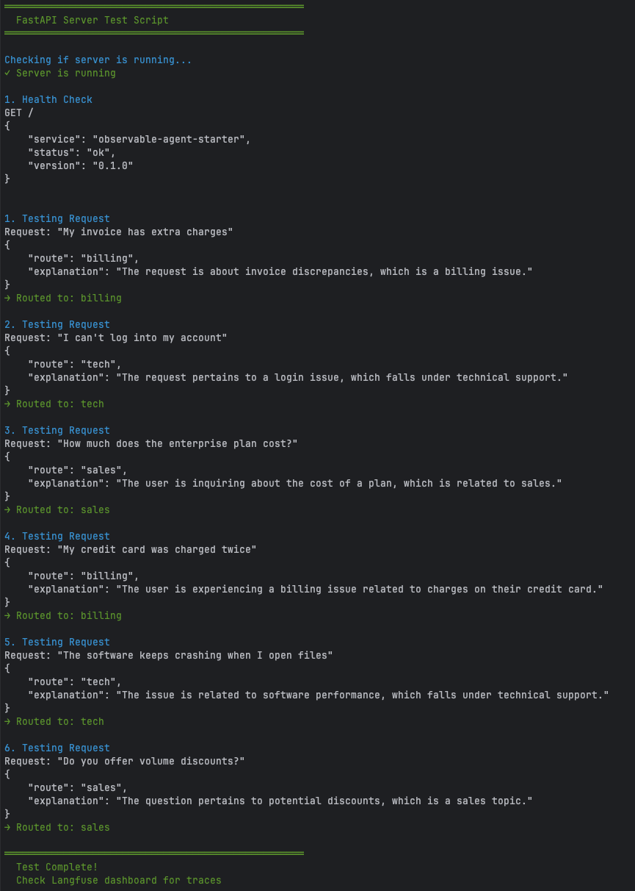

# Observable Agent Starter

[](https://github.com/ammons-datalabs/observable-agent-starter/actions/workflows/ci.yml)

Production-ready Python agent starter with built-in observability, evals, and CI. Pre-wired with:

- **DSPy** (or LangGraph) for agent logic
- **Langfuse** for tracing/observability
- **DeepEval** for LLM quality metrics
- **FastAPI** for production-ready HTTP endpoints
- **MCP client adapters** for tool calling across MCP servers
- **GitHub Actions CI** (lint, type‑check, tests, evals)
- **Dockerfile** for reproducible deployments

## Why it's useful for SMEs

Small engineering teams need agents that work reliably from day one. This starter eliminates weeks of integration work by pre-wiring DSPy (or LangGraph), Langfuse tracing, DeepEval test harness, FastAPI endpoints, and GitHub Actions CI. You get a debuggable, testable agent architecture with observability baked in—so you can focus on your domain logic instead of plumbing. The thin triage example shows the pattern; swap in your own tools/prompts and ship.

## Demo

### CLI Agent
```bash
# Run the example agent directly
python -m agents.example
# {"route": "billing", "explanation": "Policy fallback used..."}
```

### FastAPI Server
```bash
# Start the server
uvicorn examples.fastapi_server:app --reload

# Test the /route endpoint
curl -X POST http://localhost:8000/route \
  -H "Content-Type: application/json" \
  -d '{"request": "My invoice has extra charges"}'

# Response: {"route": "billing", "explanation": "..."}
```



## Quick start

```bash
# 1) Create venv & install deps (installs into .venv by default)
make dev

# 2) (Optional) export model + Langfuse creds
export OPENAI_API_KEY=...
export OPENAI_MODEL=openai/gpt-4o-mini  # optional override
export LANGFUSE_PUBLIC_KEY=...
export LANGFUSE_SECRET_KEY=...
export LANGFUSE_HOST=https://cloud.langfuse.com

# 3) Run the CLI agent
make run

# 4) Run tests + evals
make test
```

> Targets look for the virtual environment at `.venv` by default. If you prefer using an existing
> environment (for example one managed by `pyenv`), override the path when invoking make, e.g.
> `make VENV=$(pyenv prefix) test`.

Use `make evals` for DeepEval CLI guidance once you have credentials configured.

## Docker
```bash
# Build
docker build -t observable-agent-starter .

# Run (reads .env if present)
docker run --rm -it --env-file .env observable-agent-starter
```

The container runs `python -m agents.example` by default. If `OPENAI_*` and `LANGFUSE_*` are not set,
it falls back to a neutral policy and still returns a valid route.

## Using with GitHub + Codespaces (or any cloud IDE)
1. Create a new empty repo on GitHub (public for open source).
2. Download this starter as a zip, unzip, then:
   ```bash
   git init
   git add .
   git commit -m "chore: bootstrap Observable Agent Starter"
   git branch -M main
   git remote add origin <your-repo-url>
   git push -u origin main
   ```
3. Open in Codespaces (or clone locally). CI will run on each PR.
4. Set `LANGFUSE_*` as repo or Codespaces secrets if you want tracing.

## Structure
```
.
├─ agents/example/         # Example agent (DSPy-based routing)
│  ├─ agent.py            # ExampleAgent (swap with your logic)
│  ├─ config.py           # LM + Langfuse setup
│  └─ policy.py           # Fallback routing policy
├─ examples/
│  ├─ fastapi_server.py   # FastAPI production server
│  └─ influencer_assistant/  # Richer DSPy example
├─ tests/                 # Unit tests (24 passing)
├─ evals/deepeval/        # DeepEval quality metrics
├─ prompts/               # Jinja2 prompt templates
├─ mcp/servers.json       # MCP server configs
├─ .github/workflows/ci.yml  # CI pipeline
├─ pyproject.toml
├─ Makefile
└─ Dockerfile
```

## Notes
- **Swap the example agent** with your own logic—everything is isolated in `agents/example/agent.py` (`ExampleAgent` class).
- Swap DSPy for LangGraph easily; the starter keeps framework logic contained.
- `mcp/servers.json` expects the Langfuse MCP servers or your own custom ones.
- Keep prompts in `prompts/` or switch to managed prompts via MCP.
- The example agent auto-configures DSPy from `OPENAI_*` env vars, falls back to
  policy routing if the LM misbehaves, and logs all interactions to Langfuse when creds exist.
- FastAPI server (`examples/fastapi_server.py`) provides production-ready HTTP endpoints with automatic tracing.

## Examples
- `examples/influencer_assistant/` contains a richer DSPy example that models a creator portfolio,
  generates ideas, and ships with pytest coverage. Install its dependencies with
  `pip install -e '.[examples]'` (after `make dev`), then run `make test-examples` to execute its suite.
  Launch the optional Streamlit dashboard with `make demo-influencer` for an interactive walkthrough.
  Idea runs are traced to Langfuse (observation name `influencer-video-ideas`) when the same
  `LANGFUSE_*` environment variables are present.
  You can experiment with DSPy teleprompting via `make tune-influencer ARGS="--num-candidates 4"`
  (requires LM credentials) to generate a refined prompt saved under
  `examples/influencer_assistant/prompts/`.
