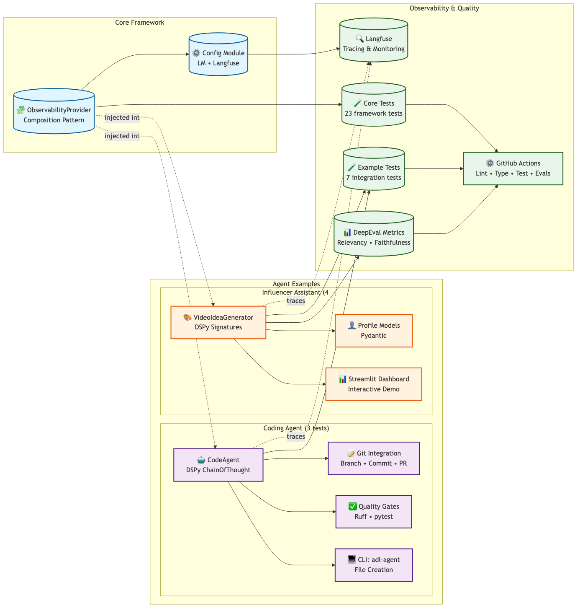

# Architecture

This document explains the architecture of Observable Agent Starter and how its components work together.

## Overview

Observable Agent Starter is built on a minimal, extensible foundation:

```
Core Framework (src/observable_agent_starter/)
    ↓
BaseAgent Pattern (extend with your logic)
    ↓
Example Implementations (coding_agent, influencer_assistant)
    ↓
Observability & Quality (Langfuse, pytest, DeepEval)
```



## Core Components

### 1. BaseAgent

The `BaseAgent` class provides the foundation for all agent implementations:

**Location:** `src/observable_agent_starter/base_agent.py`

**Key Features:**
- Automatic LM configuration from environment variables
- Langfuse tracing integration via `log_generation()`
- Logging infrastructure
- Thin interface - no opinion on agent logic

**Design Philosophy:**
BaseAgent is intentionally minimal. It handles configuration and observability, but doesn't dictate how you build your agent. You provide the DSPy signatures, modules, and business logic.

### 2. Configuration Module

**Location:** `src/observable_agent_starter/config.py`

**Responsibilities:**
- Load environment variables from `.env` files
- Configure DSPy LM (supports OpenAI and compatible APIs)
- Initialize Langfuse client for tracing
- Provide helper functions for logging generations

**Key Functions:**
- `configure_lm_from_env()` - Sets up DSPy language model
- `configure_langfuse_from_env()` - Initializes Langfuse client
- `log_langfuse_generation()` - Logs generation events

## BaseAgent Pattern

### How to Extend

Every agent inherits from both `dspy.Module` and `BaseAgent`:

```python
from observable_agent_starter import BaseAgent
import dspy

class MyAgent(dspy.Module, BaseAgent):
    def __init__(self):
        dspy.Module.__init__(self)
        BaseAgent.__init__(self, observation_name="my-agent")

        # Your DSPy signatures and modules
        self.predict = dspy.ChainOfThought(MySignature)

    def forward(self, **kwargs):
        # Your agent logic
        result = self.predict(**kwargs)

        # Log to Langfuse (optional)
        self.log_generation(
            input_data=kwargs,
            output_data={"result": result.output}
        )

        return result
```

### What BaseAgent Provides

1. **LM Configuration:**
   - Reads `OPENAI_API_KEY`, `OPENAI_MODEL`, etc.
   - Configures DSPy automatically
   - Supports multiple DSPy versions

2. **Tracing Helpers:**
   - `self.log_generation()` - Log to Langfuse
   - Automatic observation naming
   - Metadata support

3. **Logging:**
   - Configured Python logger
   - Consistent log formatting

### What You Provide

1. **DSPy Signatures:**
   - Input/output field definitions
   - Prompt structure

2. **Agent Logic:**
   - Forward pass implementation
   - Error handling and fallbacks
   - Domain-specific reasoning

3. **Evaluation Strategy:**
   - Quality metrics (DeepEval, custom)
   - Test coverage
   - Validation logic

## Example Implementations

The framework includes two production-ready examples:

### Coding Agent

**Path:** `examples/coding_agent/`

**Purpose:** Demonstrates file generation with quality gates

**Architecture:**
```
Task → CodeAgent (DSPy CoT)
         ↓
     Generate File
         ↓
     Guardrails Check
         ↓
     Strip Markdown Fences
         ↓
     Quality Gates (ruff, pytest)
         ↓
     Git Commit
```

**Key Patterns:**
- File creation (not diffs) for reliability
- Automatic markdown fence stripping
- Operational quality gates
- Git integration

### Influencer Assistant

**Path:** `examples/influencer_assistant/`

**Purpose:** Demonstrates structured data + LLM reasoning

**Architecture:**
```
Creator Profile → ProfileBuilder
                      ↓
                  Structured Context
                      ↓
              VideoIdeaGenerator (DSPy)
                      ↓
                  Quality Metrics
                      ↓
                Langfuse Tracing
```

**Key Patterns:**
- Structured data modeling (Pydantic)
- Profile context rendering
- DeepEval quality metrics
- Streamlit dashboard for demos

## Observability Layer

### Langfuse Integration

**Configuration:**
```bash
export LANGFUSE_PUBLIC_KEY=pk-...
export LANGFUSE_SECRET_KEY=sk-...
export LANGFUSE_HOST=https://cloud.langfuse.com  # optional
```

**Usage in Agents:**
```python
self.log_generation(
    input_data={"query": user_input},
    output_data={"response": agent_response},
    metadata={"version": "1.0", "model": "gpt-4"}
)
```

**What Gets Logged:**
- Input data
- Output data
- Model information
- Custom metadata
- Timing information

### Tracing Best Practices

1. **Meaningful Observation Names:**
   ```python
   BaseAgent.__init__(self, observation_name="video-ideas-generator")
   ```

2. **Structured Metadata:**
   ```python
   metadata={
       "user_id": user.id,
       "profile_version": profile.version,
       "context_size": len(context)
   }
   ```

3. **Error Logging:**
   ```python
   try:
       result = self.predict(...)
   except Exception as e:
       self.log_generation(
           input_data=inputs,
           output_data={"error": str(e)},
           metadata={"error_type": type(e).__name__}
       )
       raise
   ```

## Quality Assurance

### Testing Strategy

**Core Framework Tests:** `tests/`
- 85%+ coverage requirement
- Unit tests for config and base classes
- Test both success and error paths

**Example Tests:** `examples/*/tests/`
- No coverage requirement
- Test example-specific functionality
- Integration tests for workflows

**Evaluation Tests:** `examples/*/evals/`
- LLM-as-a-judge metrics (DeepEval)
- Quality thresholds
- Run in CI (if API keys available)

### CI/CD Pipeline

**Workflows:** `.github/workflows/`

1. **CI (`ci.yml`):**
   - Linting (Ruff)
   - Type checking (Pyright)
   - Core framework tests
   - Example tests
   - Coverage enforcement

2. **Security (`security.yml`):**
   - Bandit (SAST)
   - pip-audit (CVE scanning)
   - Weekly scheduled scans

## Extension Points

### Adding New Agents

1. Create directory: `examples/your-agent/`
2. Implement agent extending BaseAgent
3. Add tests in `examples/your-agent/tests/`
4. Optional: Add evals in `examples/your-agent/evals/`
5. Update README with your example

### Adding Evaluation Metrics

```python
from deepeval.metrics import BaseMetric
from deepeval.test_case import LLMTestCase

class CustomMetric(BaseMetric):
    def __init__(self, threshold: float = 0.7):
        self.threshold = threshold

    def measure(self, test_case: LLMTestCase):
        # Your evaluation logic
        score = evaluate(test_case.input, test_case.actual_output)
        self.score = score
        self.success = score >= self.threshold
        return self.score
```

### Custom Observability

Extend `BaseAgent.log_generation()` or create your own:

```python
def log_custom_event(self, event_type: str, data: dict):
    client = configure_langfuse_from_env()
    if client:
        client.log_event(
            name=f"{self.observation_name}-{event_type}",
            data=data
        )
```

## Design Principles

1. **Minimal Core:** The framework provides configuration and observability, not agent logic
2. **Observability-First:** Every agent run should be traceable
3. **Test-Driven:** 85%+ coverage on core, comprehensive tests on examples
4. **Production-Ready:** Examples show real-world patterns, not toys
5. **Extensible:** Easy to add new agents, metrics, and evaluation strategies

## Performance Considerations

### LM Configuration

- DSPy LM is configured once and reused
- Configuration is idempotent (safe to call multiple times)
- Supports environment-based model selection

### Langfuse Tracing

- Async logging (non-blocking)
- Client is singleton (reused across calls)
- Flush happens automatically
- Optional (gracefully degrades if not configured)

### Testing

- Fixtures reset state between tests
- Mock external dependencies (LLMs, Langfuse)
- Fast unit tests, slower integration tests

## Security

### Environment Variables

Never commit sensitive keys:
- `.env` is in `.gitignore`
- Use `.env.example` for documentation
- CI uses GitHub Secrets

### Dependency Management

- Regular security scans (Bandit, pip-audit)
- Pin transitive dependencies with security issues
- Weekly CVE checks

### Code Security

- No eval() or exec()
- Input validation on all external data
- Defensive error handling

## Further Reading

- [How to Extend BaseAgent](how-to/extend-baseagent.md)
- [DSPy Documentation](https://dspy-docs.vercel.app/)
- [Langfuse Documentation](https://langfuse.com/docs)
