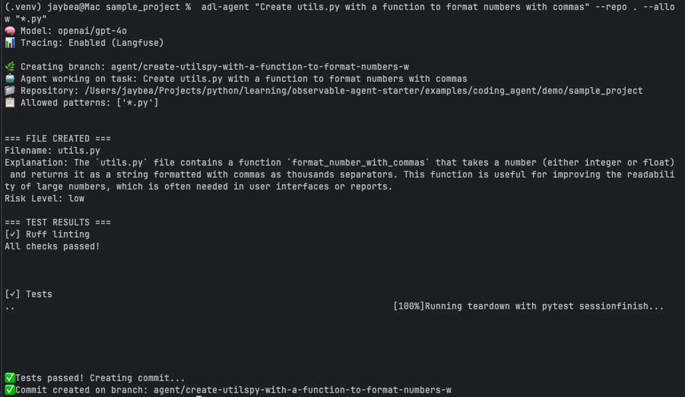

# ADL Coding Agent

An autonomous coding agent that creates new files with built-in observability, testing, and guardrails.

## Overview

This agent demonstrates a **production-ready approach** to AI-powered code generation by focusing on creating new files rather than modifying existing code. This is more reliable because LLMs struggle with exact line number calculations required for unified diff patches.



## Extending BaseAgent

This example demonstrates extending `observable_agent_starter.BaseAgent`:

```python
from observable_agent_starter import BaseAgent
import dspy

class CodeAgent(dspy.Module, BaseAgent):
    """Autonomous coding agent with guardrails."""

    def __init__(self):
        dspy.Module.__init__(self)
        BaseAgent.__init__(self, observation_name="code-agent-generate")

        # DSPy Chain-of-Thought with CodePatch signature
        self.generate = dspy.ChainOfThought(CodePatch)
```

**What BaseAgent provides:**
- Automatic LM configuration from environment variables
- Langfuse tracing helper (`self.log_generation()`)
- Logging infrastructure

**What this example adds:**
- DSPy signatures for file generation (not diffs!)
- Automatic markdown fence stripping (handles common LLM behavior)
- Guardrails and validation logic (file restrictions, risk assessment)
- Git integration and automated workflow
- Operational quality gates (lint, tests)

## Features

- **DSPy-based Agent** - Structured file generation with Chain-of-Thought reasoning
- **Langfuse Tracing** - Full observability of agent decisions and file creation
- **Guardrails** - File pattern restrictions and risk assessment via DSPy assertions
- **Smart Content Cleaning** - Automatically strips markdown code fences (```python)
- **Automated Testing** - Runs linting and tests before committing
- **Git Integration** - Creates branches, commits, and optionally opens PRs

## Architecture

```
Task Input
    ↓
CodeAgent (DSPy ChainOfThought)
    ↓
Generate File (filename + content, traced in Langfuse)
    ↓
Guardrails Check (DSPy Assertions)
    ├─ Filename validation (matches allowed patterns)
    ├─ Risk level assessment
    └─ Content validity check
    ↓
Strip Markdown Fences (automatic cleanup)
    ↓
Write File (direct file creation, no git apply)
    ↓
Run Tests (ruff + pytest)
    ↓
Commit + Optional PR
```

## Installation

```bash
cd examples/coding_agent
pip install -e .
```

## Usage

### Basic Usage - Create New Files

```bash
export OPENAI_API_KEY=your-key
export OPENAI_MODEL=gpt-4o  # optional

# Create a utility file
adl-agent "Create utils.py with a function to format numbers with commas" \
  --repo /path/to/your/repo \
  --allow "*.py"

# Create a helper module
adl-agent "Create src/helpers.py with string manipulation functions" \
  --repo /path/to/your/repo \
  --allow "src/**/*.py"
```

### Dry Run (generate file without writing)

```bash
adl-agent "Create validators.py with email validation" \
  --repo /path/to/your/repo \
  --dry-run
```

### Open PR Automatically

```bash
adl-agent "Create config.py with settings management" \
  --repo /path/to/your/repo \
  --open-pr  # requires gh CLI
```

## Configuration

### Environment Variables

- `OPENAI_API_KEY` - OpenAI API key (required)
- `OPENAI_MODEL` - Model to use (default: `gpt-4o-mini`)
- `LANGFUSE_PUBLIC_KEY` - Langfuse public key (optional, for tracing)
- `LANGFUSE_SECRET_KEY` - Langfuse secret key (optional)
- `LANGFUSE_HOST` - Langfuse host (optional, default: `https://cloud.langfuse.com`)

### CLI Options

```
adl-agent <task> --repo <path> [options]

Options:
  --allow PATTERNS     Glob patterns for allowed files (default: src/**/*.py tests/**/*.py)
  --branch-prefix STR  Branch name prefix (default: agent)
  --dry-run           Generate file but don't write
  --open-pr           Create and push PR (requires gh CLI auth)
```

## DSPy Integration

The agent uses DSPy for structured file generation:

```python
class CodePatch(dspy.Signature):
    """Generate a new code file for a given engineering task."""

    task: str = dspy.InputField(desc="Engineering task description")
    repo_state: str = dspy.InputField(desc="Current repository state")
    allowed_patterns: str = dspy.InputField(desc="Glob patterns for allowed files")

    filename: str = dspy.OutputField(
        desc="Name of the file to create (e.g., 'utils.py' or 'src/helpers.py')"
    )
    content: str = dspy.OutputField(
        desc="Complete file contents. NO markdown formatting, NO code fences!"
    )
    explanation: str = dspy.OutputField(desc="What the file does and why")
    risk_level: str = dspy.OutputField(desc="Risk assessment: low/medium/high")
```

### Key Design Decision: Files, Not Diffs

**Why we create new files instead of generating patches:**

1. **LLMs are bad at line numbers** - Unified diff format requires exact line counts
2. **Simpler prompts** - Just output complete file content
3. **More reliable** - No "corrupt patch" errors
4. **Handles markdown fences** - LLMs naturally wrap code in ```python blocks, we strip them

### Guardrails with Validation

```python
# Ensure filename matches allowed patterns
if not validate_filename(allowed_patterns, result.filename):
    raise ValueError(
        f"Filename does not match allowed patterns. "
        f"Allowed: {allowed_patterns}, Got: {result.filename}"
    )

# Validate risk assessment
if result.risk_level.lower() not in ["low", "medium", "high"]:
    raise ValueError(f"Risk level must be low/medium/high")

# Check content is not empty
if len(result.content.strip()) == 0:
    raise ValueError("File content cannot be empty")
```

### Automatic Markdown Fence Stripping

The agent automatically handles LLMs wrapping code in markdown:

```python
def strip_markdown_fences(content: str) -> str:
    """Remove markdown code fences if present."""
    lines = content.split('\n')

    # Strip ```python or ``` from start/end
    if lines and lines[0].strip().startswith('```'):
        lines = lines[1:]
    if lines and lines[-1].strip() == '```':
        lines = lines[:-1]

    return '\n'.join(lines)
```

This is applied automatically before writing the file, so even if the LLM outputs:

```
```python
def hello():
    return "world"
```
```

The actual file will contain clean Python code without the fences.

## Langfuse Tracing

Every agent run creates a trace in Langfuse with:

- **Task metadata** - Task description, repository, allowed patterns
- **Repo snapshot** - Files, diffs, status
- **File generation** - Includes filename, content length, explanation, risk level
- **Guardrail validation** - Each check logged with pass/fail
- **Test results** - Ruff linting and pytest outputs

View traces in your Langfuse dashboard under the `code-agent-generate` observation.

## Example Traces

When you run the agent, you'll see full traceability:

```
code-agent-run (trace)
  ├─ repo-snapshot (span)
  ├─ code-agent-generate (span)
  │   ├─ generate-file (span)
  │   └─ validate-guardrails (span)
  ├─ write-new-file (span)
  └─ format-lint-test (span)
```

## Testing

```bash
# Run agent tests (26 tests, all passing)
pytest tests/ -v

# Test the agent in dry-run mode
adl-agent "Create logger.py with structured logging" \
  --repo /path/to/test/repo \
  --dry-run
```

## Safety & Guardrails

The agent includes multiple safety mechanisms:

1. **File Restrictions** - Only creates files matching allowed patterns
2. **No Overwrites** - Fails if file already exists (prevents accidental overwrites)
3. **Risk Assessment** - Agent evaluates risk level (low/medium/high)
4. **Automated Testing** - Runs linting and tests before committing
5. **Git Isolation** - Works on separate branches
6. **Manual Review** - Failed tests leave branch for manual inspection

## Demo

Try the interactive demo:

```bash
cd examples/coding_agent/demo/sample_project

# Run the agent
adl-agent "Create utils.py with a function to format numbers with commas" \
  --repo . \
  --allow "*.py"
```

The agent will:
1. ✅ Generate `utils.py` with complete file content
2. ✅ Strip any markdown fences automatically
3. ✅ Run ruff linting - passes!
4. ✅ Run pytest tests - passes!
5. ✅ Create git commit on new branch

## Advanced: DSPy Optimization

You can optimize the agent's prompts using DSPy teleprompting:

```python
from dspy.teleprompt import BootstrapFewShotWithRandomSearch

# Collect training examples
examples = [
    dspy.Example(
        task="Create utils.py with string helpers",
        repo_state=repo_snapshot(...),
        allowed_patterns="*.py",
        filename="utils.py",
        content="def reverse(s): return s[::-1]"
    ).with_inputs("task", "repo_state", "allowed_patterns")
]

# Optimize
optimizer = BootstrapFewShotWithRandomSearch(
    metric=lambda example, pred, trace: (
        pred.filename == example.filename and
        tests_pass(pred.content)
    ),
    max_bootstrapped_demos=3
)

optimized_agent = optimizer.compile(CodeAgent(), trainset=examples)
```

## Why This Example?

This coding agent demonstrates:

1. **Real-world DSPy usage** - Not just routing, but complex structured generation
2. **Production-ready patterns** - Handles common LLM quirks (markdown fences)
3. **End-to-end observability** - Every decision traced in Langfuse
4. **Smart guardrails** - File restrictions, risk assessment, automated testing
5. **Reliable execution** - No "corrupt patch" errors by avoiding diff generation
6. **Verifiable output** - Git commits and PRs provide auditable evidence

Perfect for demonstrating agent capabilities to potential employers or collaborators.

## Limitations & Future Work

**Current scope: Creating new files only**

This version focuses on creating new files, which is:
- ✅ More reliable (no line number calculations)
- ✅ Simpler for LLMs to reason about
- ✅ Easier to test and validate

**Future enhancements could include:**
- Modifying existing files (requires more sophisticated diff handling)
- Multi-file operations (create multiple related files)
- Test generation (automatically create tests for new code)
- Documentation generation (auto-generate docstrings)

## License

MIT (same as parent project)
